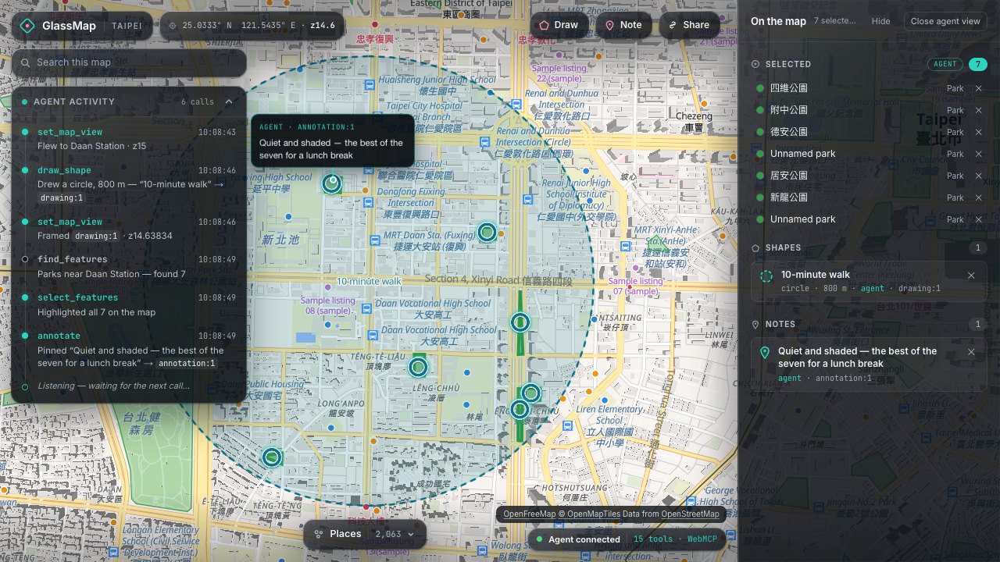
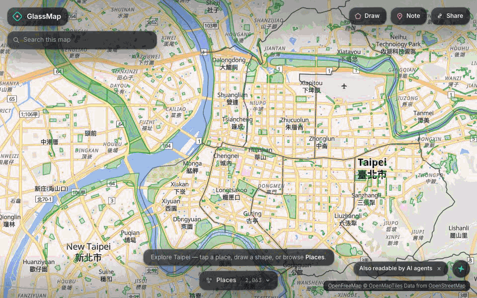
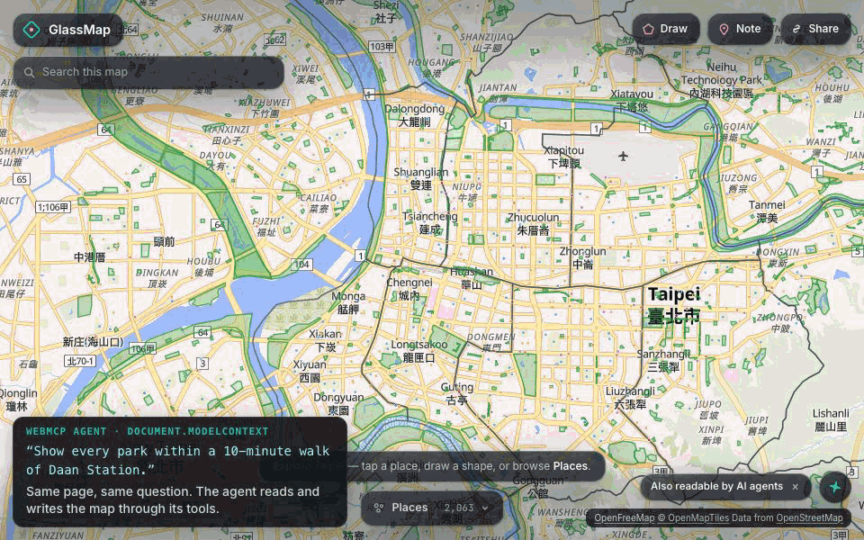
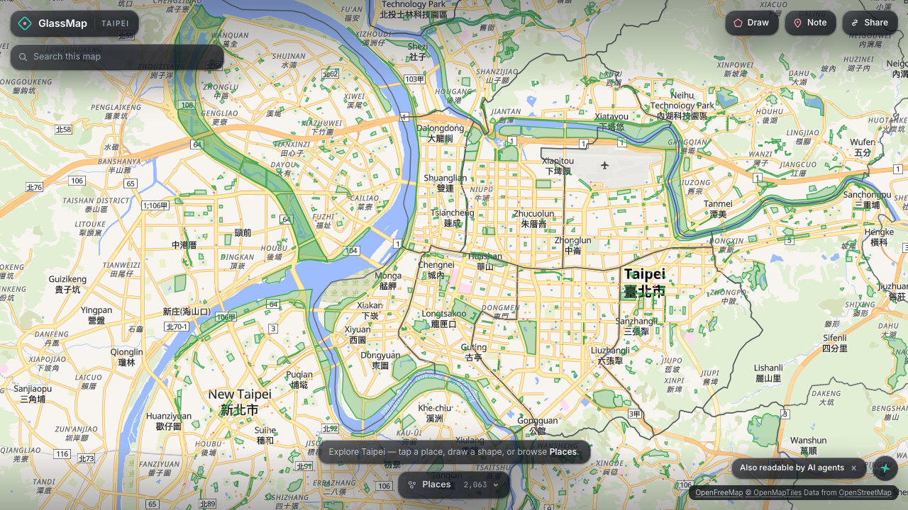

# GlassMap
**A web map is a WebGL canvas — a black box to AI agents. WebMCP makes it glass.**

Live: **https://glassmap.clyeh.xyz** · **15 WebMCP tools, no backend, no API keys** · Built for [The WebMCP Challenge](https://webmcp.devpost.com/) (Aug 25 – Sep 3, 2026).



## Why "Glass"
To an agent, every station, park and pin on a web map is just pixels. A screenshot can't read an unlabeled green polygon, a click stops working the moment the zoom changes, and drawing a shape, measuring a distance or selecting every park in view is essentially impossible from a picture. WebMCP exposes the map's state, features and actions as tools instead, so an agent never has to guess from pixels — the black box becomes **glass**. Every web map has this problem — property search, delivery planning, travel — and the fix is a tool contract, not a bigger screenshot model. For someone who cannot see the map at all, the same read-only tools double as agent-mediated map access.

## The same task, two ways
Both agents get the same sentence — *"Show every park within a 10-minute walk of Daan Station."*, the first "Try asking" card on the page. Open the live site and say it verbatim.

**Screenshot agent**

19 UI actions · 8 screenshots → 2 of 7 parks. The 800 m "circle" is an eight-vertex polygon with a guessed radius — the page shows no scale bar and no zoom readout — and the other five parks are never found: each one costs another click-and-read round trip, and nothing on screen says how many are left.

**WebMCP agent**

5 tool calls · 2.9 KB returned · 82 ms of tool time · 0 screenshots → all 7 parks inside an exact 800 m circle, each with an id, a distance and a compass direction — two of them parks OpenStreetMap never named:
`set_map_view({ place: "Daan Station" })` → `draw_shape({ type: "circle", center: "Daan Station", radius_m: 800, label: "10-minute walk" })` → `set_map_view({ fit: "drawing:1" })` → `find_features({ near: "Daan Station", radius_m: 800, categories: ["park"] })` → `select_features({ ids: [...] })`.

Both clips are scripted replays in Playwright's headless Chromium, not a live model; the scripts that record them, and count every action, screenshot, call and byte in the captions, are in [`scripts/media/`](./scripts/media/). The screenshot agent gets only what a computer-use agent has — a search box, clicks, keys, the mouse wheel and screenshots. The WebMCP agent calls `document.modelContext.executeTool`, the same call a native agent makes, through the page's own `?shim=1` surface, since headless Chromium has no WebMCP of its own.

Three other tasks, with a live model ([method and caveats](./docs/comparison.md)):

| Task | Screenshot agent | WebMCP |
|---|---|---|
| Move to a station, mark an 800 m radius | 16 actions + 7 screenshots (~6 min); circle approximated, centring 33 m off | 2 calls, 576 B (~1 s); exact centre, true circle |
| List the parks in view, by name | 3 screenshots; **1 of 11** parks nameable | 1 call, ~1.2 KB; all **11** parks, named |
| Distance and direction to a named park | 1 screenshot + pixel math; ≈426 m, +20% error | 1 call, 2,771 B; **355 m**, ground truth |

## Try it
**Chrome 149+:**

1. Enable `chrome://flags/#enable-webmcp-testing` and restart Chrome.
2. Open **https://glassmap.clyeh.xyz**.
3. Open the [Model Context Tool Inspector extension](https://developer.chrome.com/docs/ai/webmcp) or any WebMCP-capable agent and ask it one of these, verbatim:
   - "Show every park within a 10-minute walk of Daan Station." → `draw_shape` · `find_features` · `select_features`
   - "Compare Daan District and Xinyi District for parks and supermarkets." → `compare_areas`
   - "Describe the area around Daan Station." → `describe_surroundings`
   - "How big is Daan Forest Park?" → `find_features` · `measure`
   - "What is the phone number and address of the post office nearest Daan Station?" → `find_features` · `get_place_details`

**ChatGPT desktop app:** with *Enable site tools* on, open its built-in browser on the live site and ask the same sentences — it finds the page's tools with no Chrome flag.

Or call the tools directly from DevTools:

```js
const tools = await document.modelContext.getTools();
const byName = Object.fromEntries(tools.map((t) => [t.name, t]));
await document.modelContext.executeTool(byName.set_map_view, { place: "Daan Park Station" });
const found = await document.modelContext.executeTool(byName.find_features, {
  near: "Daan Park Station",
  radius_m: 800,
  categories: ["park"],
});
JSON.parse(found);
```

Any other browser works with `?shim=1` appended to the URL: the page installs `document.modelContext` itself when the browser has none. Development builds do this by default.

## Fifteen tools
Three layers, in that order: **Perceive** (read-only — replaces screenshots), **Navigate** (camera only) and **Act** (writes page state; only routing calls an external service).

| Tool | What it does |
|---|---|
| `get_map_state` | Reads the camera, bounds, feature count, selection, drawings and notes in one call — no screenshot needed. |
| `list_features_in_view` | Lists what's on screen right now, nearest first, each with distance and compass direction. |
| `find_features` | Searches every loaded feature by name, category, distance from a point, or containment inside a shape. |
| `describe_surroundings` | Describes what's around a point out loud: the district, then nearby features by compass direction. |
| `measure` | Measures a drawing's or feature's area, perimeter or length. |
| `compare_areas` | Compares two places' per-category counts and nearest match, in one call. |
| `get_place_details` | Returns everything known about one place: address, phone, website, hours and `wheelchair`, as tagged in OpenStreetMap. |
| `get_share_link` | Builds a URL that restores this exact map — camera, selection, drawings, notes — for whoever opens it. |
| `set_map_view` | Moves the camera by place name, feature id, `fit` (frame a drawing or feature whole), or exact center/zoom/bearing/pitch. |
| `select_features` | Highlights features on the map and in the inspector, by id or the same filter `find_features` accepts. |
| `draw_shape` | Draws a circle, polygon or line so the human can see the area being discussed. |
| `plan_route` | Plans a walking route via the keyless FOSSGIS OSRM service and draws it as a line. |
| `annotate` | Pins a short note to a place on the map. |
| `remove_from_map` | Removes the agent's own drawings, notes or a selection entry; refuses to touch what a human drew. |
| `add_note` (`<form toolname="add_note">`) | Pins a note from a plain HTML form; `SubmitEvent.agentInvoked` decides `source: "agent"` or `"user"`. |

Every tool keeps five rules:

- A write tool returns the new map state, so no follow-up read is needed.
- A read-only tool carries `readOnlyHint: true`.
- Output containing readable OpenStreetMap or user text carries `untrustedContentHint: true`.
- Responses stay small: `limit` defaults to 20, coordinates round to 5 decimals, geometry returns by id.
- Bad input returns a structured `{ error }`, never throws; no `alert` / `confirm` / `prompt` anywhere.

More on how each tool behaves: [`docs/details.md`](./docs/details.md).

## One map, two hands
The map is shared state, not a private channel for the agent.


- The page opens as a plain map. The first live tool call wakes the inspector and activity feed into view, and a human can open or close that view by hand at any time (a share link that carries agent state opens with that view already up).
- **Who did what.** Every shape and note carries `source: "agent"` or `"user"` — the tag a human sees on the mark, and the same field an agent reads back from `get_map_state`. A shape drawn by hand appears with `source: "user"` and is immediately queryable with `find_features({ within: "drawing:<n>" })`; a shape or note an agent draws or annotates renders at once with its own tag and a ✕ to remove it — no confirmation dialog on either side. `remove_from_map` takes off only the marks tagged `agent`; a human's it refuses, by id, with the reason.
- **On the record — on screen.** Every tool call lands on the activity feed as a row — the tool, a one-line summary, success or error, when, and the ids it touched — the last 50 kept, its sequence number still counting past that. A human's own actions write no row: their trail is the tag on the mark, not a line in the feed.
- **Two WebMCP APIs, one state.** The pin-note field is a plain `<form toolname="add_note">` — no JavaScript registration — and `SubmitEvent.agentInvoked`, the browser's own signal rather than a guess the page makes, decides whether the note is stored as `agent` or `user`.
- A search box lets a human find a place, calling no tool; a Places tray loads any of 18 OpenStreetMap categories, up to 3 painted at once — a fourth tap evicts the oldest and says so.
- With the Note popover open, a click on the map places the pin there — a second click moves it, `Escape` cancels — and with no click, the note pins at the map centre.
- A Route pill: click a start and an end, and the same walking-route service `plan_route` uses draws the walk as a `source: "user"` line, labelled with its distance and time (`walking route · 3.8 km · 47 min`) — a mark `remove_from_map` refuses like any other of the human's.
- Every tool call plays a brief effect on the map, capped at 2 seconds — teal for the agent, rose for a human action. `?fx=off` turns it off, and it honours `prefers-reduced-motion`.
- The address bar holds a link that restores this exact map — camera, selection, drawings and notes, each still tagged `agent` or `user` — for whoever opens it.

## Data
Six bundled Taipei datasets are always in memory — 109 MRT stations, 12 districts, 865 parks, 445 schools, 607 supermarkets and 25 sample listings (fictional, not from OSM) — 2,063 features total. 18 more OpenStreetMap point-of-interest categories (31,069 features) load lazily, one at a time, the moment a category is named; an answer that didn't search one lists it under `unsearched_categories`. Full provenance and tag mapping: [`public/data/README.md`](./public/data/README.md).

- Map data © [OpenStreetMap](https://www.openstreetmap.org/copyright) contributors, [ODbL](https://opendatacommons.org/licenses/odbl/). Tiles by [OpenFreeMap](https://openfreemap.org/).
- Listings shown are **sample data**, not real properties.
- Code: [MIT](./LICENSE).

## How it is built
A single Next.js app on Vercel — **no backend, no database, no API keys, no login**. [MapLibre GL JS](https://maplibre.org/) renders [OpenFreeMap](https://openfreemap.org/) vector tiles; [Turf.js](https://turfjs.org/) runs every spatial query in the browser; [Zustand](https://zustand.docs.pmnd.rs/) holds map state. Tools in `src/lib/map-tools/` talk to the map only through a `MapToolStore` interface, so they are unit-tested against an in-memory store. `src/lib/webmcp/register.ts` registers on both `document.modelContext` and `navigator.modelContext`, cancellable via `AbortSignal`. The one external service is the keyless FOSSGIS OSRM instance that plans walking routes, asked by `plan_route` and by the human Route pill through one shared throttle that keeps its 1 request/second policy; when the service is unreachable the tool returns an error, the pill says so, and the map is left unchanged.

```bash
pnpm install
pnpm dev          # http://localhost:3000
pnpm check        # typecheck + lint + unit tests
pnpm test:e2e     # Playwright, via document.modelContext
pnpm build
```

CI runs `pnpm check`, `pnpm build` and `pnpm test:e2e` on every code PR: 1,436 unit tests across 60 files. Node 22. Branching, worktrees, commit and PR conventions: [CONTRIBUTING.md](./CONTRIBUTING.md).
